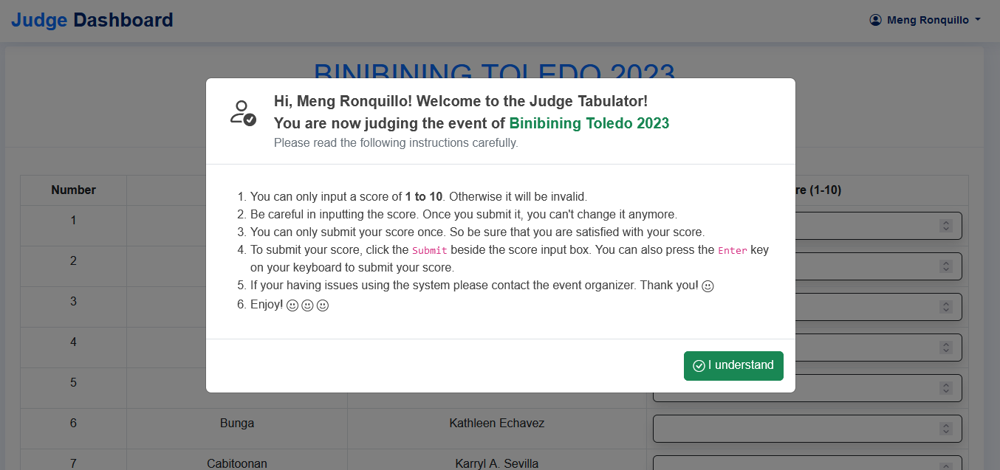

## Tabulation System for the 2023 Toledo City Fiesta

### Description

This project is a tabulation system for the 2023 Toledo City Fiesta. It is a web-based system that will be used to tabulate the scores of the different contingents that will be joining the fiesta.

### Features

1. Login for the admin and the judges
2. Contingent Registration for the admin
3. Score Encoding for the judges
4. Score Tabulation for the admin
5. Announcement of Winners for the admin

### Technologies

- Programming Language: PHP, JavaScript, HTML, CSS
- Database: MySQL
- Web Server: XAMPP (Apache)

### Source Code

The source code of this project is available on GitHub. You can access it [here](https://github.com/aynjel/tabulation-ajax-php-mysql).

### Screenshots

#### Admin Login

#### Admin Dashboard

#### Admin Criteria

#### Admin Events

#### Admin Event Details

#### Manage Event

#### Start and Stop Event

#### Results Tabulation

#### Judges Login

#### Judges Add Score

#### Judges Success Login

#### Judges Submit Score

#### Judges Added Score

